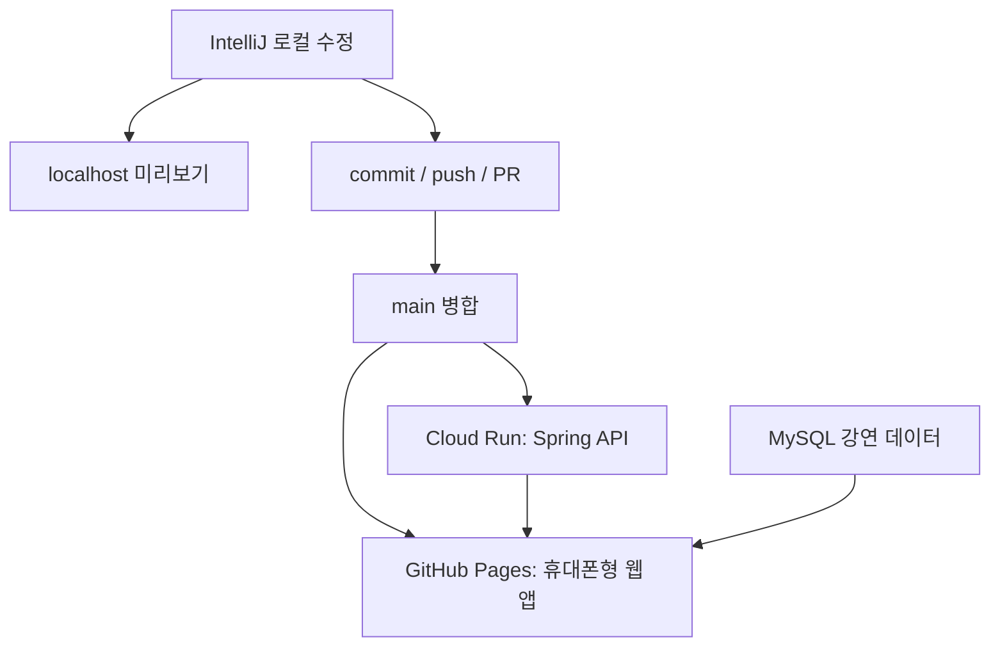

# 휴대폰형 Live App과 자동 배포

이 저장소의 `docs/dashboard/`는 별도 앱 빌드 도구 없이 동작하는 정적 웹 앱입니다. GitHub Pages가 이 폴더를 배포하고, 브라우저는 Cloud Run의 Spring Boot API에서 실제 강연·아티클·관심 키워드 데이터를 읽습니다.



## 앱에서 실제로 보이는 기능

| 탭 | 실제 API | 하는 일 |
| --- | --- | --- |
| 홈 | `GET /lectures` | 로그인한 사용자의 최근 공개 강연 표시 |
| 검색 | `GET /lectures/search` | 강연 제목 검색 |
| 관심 | `GET /tags`, `GET/PUT /users/me/interests`, `GET /lectures/recommended` | `#신약개발` 같은 키워드 선택과 추천 강좌 표시 |
| 내 정보 | `POST /auth/login`, `GET /actuator/health`, `GET /public/release` | 로그인, 서버 연결, 프런트/서버 revision 확인 |
| 강연 상세 | `GET /lectures/{id}` | 아티클, 이미지, 동영상까지 표시 |

토큰은 `sessionStorage`에만 저장되고 탭을 닫으면 사라집니다. API 주소는 공개 URL만 사용합니다. DB 비밀번호, Gmail 앱 비밀번호, JWT secret은 웹 화면이나 GitHub Actions Variable에 넣지 않습니다.

## ‘바로 반영’의 정확한 의미

| 변경한 곳 | 반영 위치 | 필요한 동작 |
| --- | --- | --- |
| IntelliJ의 `docs/dashboard` HTML/CSS/JS | 내 PC의 가상 휴대폰 화면 | 저장 후 브라우저 새로고침 |
| IntelliJ의 Kotlin 서버 코드 | 내 PC의 가상 휴대폰 화면 | 로컬 Spring 서버를 다시 실행한 뒤 화면 새로고침 |
| GitHub 기능 브랜치 | PR/CI | Push 후 PR에서 테스트 확인. 공개 Pages에는 반영하지 않음 |
| GitHub `main` | 공개 GitHub Pages | Push/병합 후 Actions가 새 정적 화면을 배포 |
| GitHub `main`의 Kotlin 코드 | 공개 API | Cloud Run 배포 workflow를 설정·활성화한 경우에만 반영 |
| 운영 DB의 강연 데이터 | 공개 휴대폰 화면 | 브라우저가 30초마다 현재 탭의 강연 목록과 서버 상태를 갱신 |

즉, 저장만 한 IntelliJ 파일이 인터넷의 공개 사이트를 즉시 바꾸지는 않습니다. 공개 반영은 반드시 `commit → push → main 병합 → Actions/Cloud Run 배포`를 거칩니다. 이 분리가 원본·운영 서버를 실수로 바꾸지 않게 합니다.

## 1. IntelliJ에서 로컬 가상 휴대폰 화면 확인

1. Docker Desktop을 실행한 뒤 프로젝트 루트에서 MySQL을 시작합니다.

   ```bash
   docker compose up -d mysql
   ```

2. IntelliJ Run Configuration에 로컬 전용 값을 넣고 `Application.kt`를 실행합니다.

   ```text
   DB_URL=jdbc:mysql://localhost:3306/lecture_archive
   DB_USER=root
   DB_PASSWORD=<로컬 전용 비밀번호>
   JWT_SECRET=<32자 이상 로컬 전용 secret>
   CORS_ALLOWED_ORIGINS=http://localhost:63342,http://localhost:5173
   ```

3. IntelliJ에서 `docs/dashboard/index.html`을 열고 브라우저 미리보기로 엽니다. IntelliJ 기본 내장 서버 주소가 `http://localhost:63342/...`이면 위 CORS 값과 맞습니다.
4. 휴대폰 화면의 **내 정보 → Cloud Run API 주소**에 `http://localhost:8080`을 넣습니다.
5. 서버 계정으로 로그인합니다. 이제 IntelliJ에서 수정한 API와 웹 화면을 실제 데이터로 함께 확인할 수 있습니다.

`docs/dashboard` 파일은 저장 후 웹 브라우저를 새로고침하면 즉시 반영됩니다. Kotlin 코드 변경은 Spring Boot 실행을 다시 시작해야 확실히 반영됩니다.

## 2. GitHub Pages 공개 설정

이 작업은 GitHub의 **Settings** 화면에서 한 번만 합니다.

1. `Settings → Pages → Build and deployment → Source`를 **GitHub Actions**로 선택합니다.
2. `Settings → Secrets and variables → Actions → Variables`에서 다음 공개 Variable을 추가합니다.

   ```text
   EXP_ARCHIVE_API_BASE_URL=https://<실제-Cloud-Run-URL>
   ```

3. `main`에 병합되면 `.github/workflows/deploy-dashboard.yml`이 매 커밋마다 다음을 수행합니다.

   - 공개 API URL을 `api-config.js`에 주입
   - 현재 GitHub commit SHA와 배포 시각을 `deploy-meta.js`에 주입
   - `docs/dashboard`를 GitHub Pages로 배포

배포 후 주소는 다음입니다.

```text
https://haru1dh.github.io/SNUTI.ExP-archive-server/
```

기능 브랜치에서 수동 Pages 배포를 눌러도 public 사이트를 덮어쓰지 않도록 `main` branch guard를 넣었습니다.

## 3. Cloud Run 자동 배포를 안전하게 켜기

`.github/workflows/deploy-api.yml`은 기본적으로 **비활성**입니다. Google Cloud 인증·비밀값을 확인하기 전에는 운영 서버를 변경하지 않습니다.

### 먼저 Google Cloud에서 할 일

1. 과거에 노출된 DB 비밀번호, Gmail 앱 비밀번호, JWT secret 및 관련 cloud credential을 모두 회전합니다.
2. Cloud Run 서비스 `snuti-exp-archive-server-git`에 새 값을 Secret Manager 또는 Cloud Run secret/environment 설정으로 연결합니다.

   ```text
   DB_URL
   DB_USER
   DB_PASSWORD
   JWT_SECRET
   GMAIL_USERNAME              # 메일 기능을 운영할 때만
   GMAIL_APP_PASSWORD          # 메일 기능을 운영할 때만
   CORS_ALLOWED_ORIGINS=https://haru1dh.github.io
   ```

3. GitHub Actions 전용 Google Cloud service account와 Workload Identity Federation을 만듭니다. 이 신뢰 관계는 **이 저장소의 `main` branch만** 배포할 수 있도록 제한합니다.
4. 해당 service account에 Cloud Build 실행 권한을 부여합니다. Cloud Build 실행 service account에는 Artifact Registry 쓰기, Cloud Run 배포, 런타임 service account 사용 권한이 필요합니다. 실제 조직 권한 구조에 맞춰 최소 권한으로 설정하세요.

GitHub Actions의 OIDC 인증은 장기 서비스 계정 JSON 키를 저장하지 않습니다. Workload Identity Provider 전체 경로와 service account 이메일이 필요하며, Google의 인증 Action도 이 방식을 지원합니다.

### GitHub Variables

`Settings → Secrets and variables → Actions → Variables`에 다음을 추가합니다.

```text
GCP_PROJECT_ID=<Google Cloud project ID>
GCP_WORKLOAD_IDENTITY_PROVIDER=projects/<project-number>/locations/global/workloadIdentityPools/<pool>/providers/<provider>
GCP_SERVICE_ACCOUNT=<GitHub-배포용-service-account>@<project>.iam.gserviceaccount.com
CLOUD_RUN_DEPLOY_ENABLED=true
```

마지막 Variable을 `true`로 바꾸기 전에는 Cloud Run 배포 job이 안전하게 skip됩니다. `cloudbuild.yaml`은 배포할 revision만 `APP_RELEASE_REVISION`으로 추가하며, 기존 secret/environment mapping은 덮어쓰지 않습니다.

배포가 끝난 뒤 확인할 주소:

```text
https://<Cloud-Run-URL>/actuator/health
https://<Cloud-Run-URL>/public/release
https://<Cloud-Run-URL>/swagger-ui/index.html
```

휴대폰 화면의 **내 정보 → 현재 배포 버전**에서 웹 화면과 API 서버 revision이 같으면 같은 GitHub 커밋 기준으로 배포된 것입니다. 다르면 Cloud Run 배포 중이거나 브라우저가 이전 Pages artifact를 보고 있는 상태입니다.

## 4. 현재 PR 순서

이 저장소의 작업은 쌓인 Draft PR입니다.

1. PR #1 `feat/live-dashboard-20260924` — 보안 설정과 첫 Pages 대시보드
2. PR #2 `feat/interest-keyword-courses` — 관심 키워드와 추천 강좌
3. 이 PR `feat/mobile-live-app-preview` — 휴대폰형 화면, 실제 30초 갱신, revision 표시, 배포 workflow

민감정보를 회전하고 Cloud Run 설정을 확인한 뒤 PR #1 → PR #2 → 이 PR 순서로 `main`에 병합합니다. 각 PR의 CI가 통과한 것을 확인하고, `main`에는 직접 수정하지 않습니다.

## 5. 운영 전 점검

- [ ] GitHub Pages source가 GitHub Actions인지 확인
- [ ] `EXP_ARCHIVE_API_BASE_URL`이 실제 HTTPS Cloud Run URL인지 확인
- [ ] Cloud Run CORS에 정확히 `https://haru1dh.github.io`가 포함됐는지 확인
- [ ] `/actuator/health`가 `UP`인지 확인
- [ ] 일반 사용자로 로그인·검색·상세·관심 키워드 저장을 확인
- [ ] 웹/API revision mismatch가 없는지 확인
- [ ] DB/Gmail/JWT/AWS credential이 GitHub 파일·Variables·browser에 없는지 확인
- [ ] Gradle test가 통과했는지 확인
